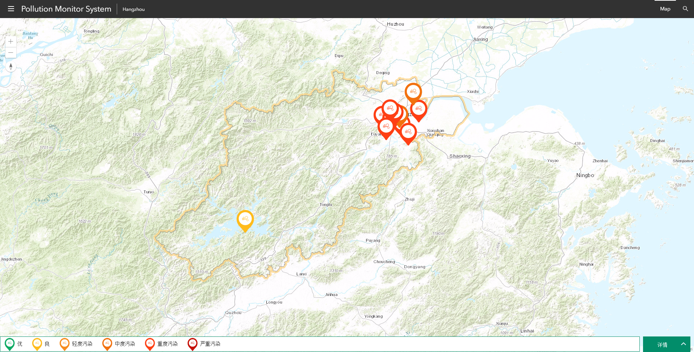
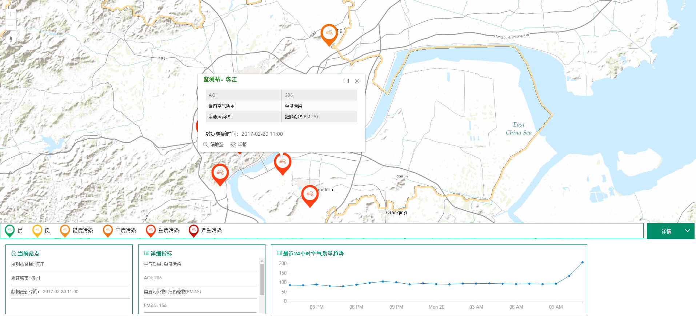

# squeak

Squeak is a web GIS template developed by ArcGIS API for javascript.

## What's included

* Full map view
* Basemap switch
* Real-time query
* Data storage in PostgreSQL
* Using ArcGIS Server services
* Dojo support
* Charts

## Example

This example references Bootstrap, Calcite Maps, ArcGIS and the appropriate JS files. It is a Pollution Monitor System which displays pollution data in Hangzhou.

### Features

* Map Services and Feature Services are published and deployed on ArcGIS Server
* Synchronize pollution data, and stored in PostgreSQL database (AWS RDS)
* Real-time query data and display in GraphicsLayer with different symbols to identify air quality
* Detailed pollution data demonstration with tables and Charts
* Multiple basemaps switch enabled

[Try it live!](https://xzdbd.com/squeak/pollution)

## Resources

* [ArcGIS for JavaScript API](https://developers.arcgis.com)
* [PM2.5 API](http://www.pm25.in/api_doc)
* [Calcite Maps](https://github.com/Esri/calcite-maps)

## Issues

Find a bug or want to request a new feature? Please let me know by submitting an issue. Thank you!

## To-Do

* Purge ArcGIS service's cache when data is updated
* Enable cache in application
* Spatial analytics features
* OLAP features

